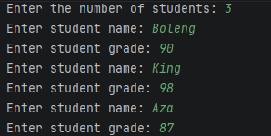
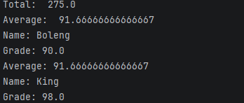
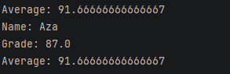
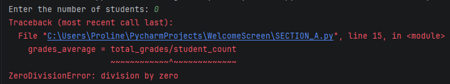

# THE GRADEBOOK MANAGEMENT SYSTEM ASSIGNMENT

The Gradebook Management System is a python-based program that helps manage student grades efficiently using organized Python structures like lists, tuples and dictionaries. It allows users to add, update, view, and delete student information.

## SETUP INSTRUCTIONS

- Ensure that python 3 is installed on the device.
- Open the .py file in a python environment.
- Run the python script.
- Follow the prompts displayed in the terminal.
  
## SECTION A - Basic Student Management

### Features

• Prompts the user to enter their number of students
• ⁠ Prompts the user to enter student names
• ⁠ Prompts the user to enter student grades
• ⁠ Calculates the grades total
• ⁠ Calculates the average
• ⁠ Displays the grades total
• ⁠ Displays the average
• ⁠ Performs grade validation to ensure that grades entered are between 0 and 100

###  Example  Input/Output  
This is a demonstration of how the program runs and the key features implemented.

###  Assumptions  and  Limitations  

- Grades entered should be 0 zero and 100
- Grades can be whole numbers or numbers with decimal points
- Each student should have one grade

## Testing Summary
| Test | What was tested | Expected result | Actual result | Status |
|---|---|---|---|---|
| 1 | 3 students with valid grades were entered | The students should be accepted and stored | All 3 students were accepted and stored | Pass |
| 2 | Input a grade of 60 | The program should accept the grade | The program accepted the grade | Pass |
| 3 | Enter a grade of 109 | The program should reject the grade and ask for a valid one | The program rejected the grade and asked for for an input between 0 and 100 | Pass |
| 4 | Test grade of -18 | The program should reject the grade and ask for another one | The program rejected the grade and asked for another one | Pass |
| 5 | Enter different student names and grades | The total and average should be calculated | The total and average were calculated and displayed | Pass |
| 6 | Enter a student count of 0 | A zero division error | Terminal displayed a zero division error | Pass |
| 7 | Entering a grade of 0 | The program should accept the grade | Grade was accepted | Pass |
| 8 | Entering a grade of 100 | The program should accept the grade | Grade was accepted | Pass |

###  Known  Issues  

When prompted for the number of students and a user enters 0, the program encounters at division by zero error meaning does not handle a student count of 0 when the average is calculated. 

### References
 
 W3Schools Python Tutorials. [W3Schools – Python Tutorial](https://www.w3schools.com/python/)
